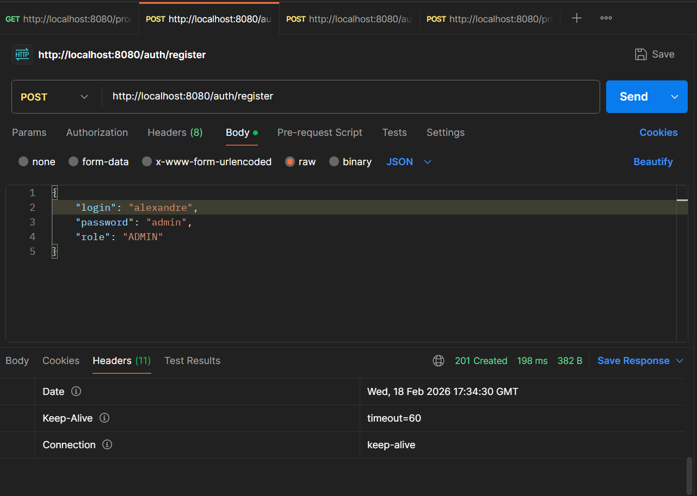
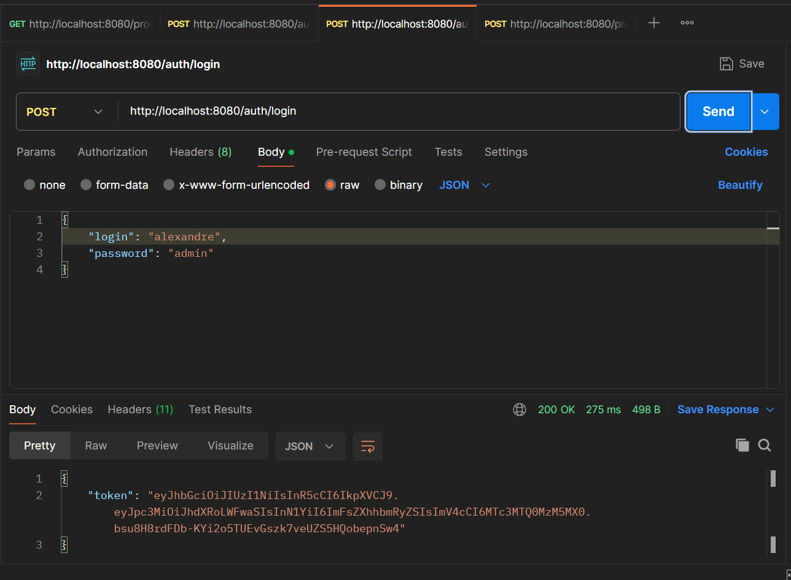
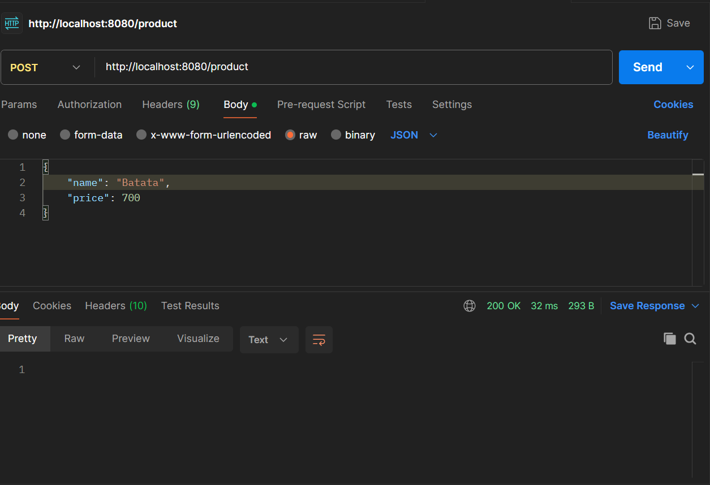
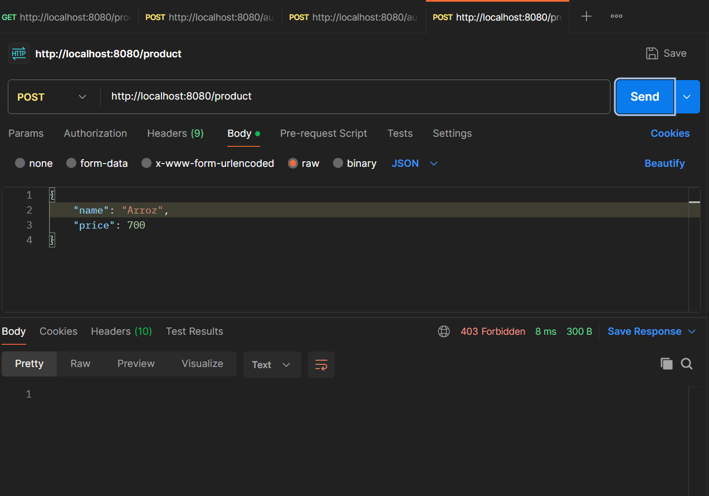

# Spring Security Auth API 🔐

<div align="center">
  
  
  
  
</div>

## 📌 Sobre o Projeto
Esta é uma API REST robusta desenvolvida com **Spring Boot 3** focada em autenticação e autorização escalável. O projeto implementa um sistema de controle de acesso baseado em Roles (RBAC), utilizando **Spring Security 7** e tokens **JWT (JSON Web Tokens)** para manter o estado stateless da aplicação.

Foi projetado como o módulo de segurança central para futuros projetos, garantindo que diferentes níveis de usuários (ADMIN, USER) acessem apenas os recursos permitidos.

## 🚀 Funcionalidades
- **Registro de Usuários**: Cadastro com criptografia de senha via BCrypt.
- **Autenticação Stateless**: Login com geração de Token JWT.
- **Hierarquia de Roles**: Implementação de `RoleHierarchy` (ADMIN > USER).
- **Proteção de Endpoints**: Controle granular de acesso por método HTTP e URL.
- **Validação de Dados**: Uso de Bean Validation (Jakarta) para integridade dos inputs.

## 🛠️ Stack Tecnológica
- **Backend:** Java 17, Spring Boot 3.4.x
- **Segurança:** Spring Security 7 (Lambda DSL), Auth0 JWT
- **Banco de Dados:** PostgreSQL, Spring Data JPA, Flyway (Migration)
- **Produtividade:** Lombok, Jakarta Validation
- **Ferramentas:** Maven, Postman/Insomnia


## 🏗️ Arquitetura de Segurança
A segurança é implementada através de uma corrente de filtros customizada:
1. **CSRF**: Desabilitado para conformidade com APIs Stateless.
2. **Session Management**: Configurada como `STATELESS`.
3. **Role Hierarchy**: Define que um `ROLE_ADMIN` herda todas as permissões de um `ROLE_USER`.
4. **Password Encoding**: Utiliza `BCryptPasswordEncoder` com Salt adaptável.

## 📋 Endpoints Principais
<div align="center">
  
### Autenticação (`/auth`)
| Método | Endpoint | Descrição | Acesso |
| :--- | :--- | :--- | :--- |
| POST | `/auth/login` | Autentica usuário e retorna Token | Público |
| POST | `/auth/register` | Cria um novo usuário | Público |

### Produtos (`/product`)
| Método | Endpoint | Descrição | Acesso |
| :--- | :--- | :--- | :--- |
| GET | `/product` | Lista todos os produtos | Autenticado |
| POST | `/product` | Cadastra novo produto | ADMIN |
</div>

## 📸 Demonstração (Postman)

### 1. Registro de Usuário
<p>Registro de um novo usuário com criptografia automática de senha.</p>
<div align="center">
  
</div>

### 2. Login e Geração de JWT
<p>Autenticação do usuário e recebimento do Token para acesso aos endpoints protegidos.</p>
<div align="center">
  
</div>

### 3. Teste de Autorização (RBAC)
<p>Tentativa de acesso a rota de ADMIN com um usuário ADMIN (Retorno 200 Ok esperado).</p>
<div align="center">
  
</div>

<p>Tentativa de acesso a rota de ADMIN com um usuário comum (Retorno 403 Forbidden esperado).</p>
<div align="center">
  
</div>

## ⚙️ Configuração e Execução

1. **Clonar repositório**

git clone [https://github.com/alexandrecarloss/security.git](https://github.com/alexandrecarloss/security.git)


2. **Configurar Banco de Dados**
Altere o src/main/resources/application.properties com suas credenciais PostgreSQL:
```bash
# No arquivo src/main/resources/application.properties:
spring.datasource.url=jdbc:postgresql://localhost:5432/nome_do_seu_banco
spring.datasource.username=seu_usuario
spring.datasource.password=sua_senha
```
  
3. **Executar a aplicação**
```bash
mvn spring-boot:run
```

## 🎓 Créditos e Referência

Este projeto foi desenvolvido como parte de um estudo aprofundado sobre Spring Security, seguindo o roteiro técnico do canal **Fernanda Kipper**. O objetivo foi consolidar conhecimentos em:
- Configuração de filtros de segurança com Spring Boot 3.4+.
- Implementação manual de autenticação via `AuthenticationManager`.
- Migração de padrões antigos para as novas **Lambda DSLs** do Spring Security.

[Assista ao tutorial original aqui](https://www.youtube.com/watch?v=5w-YCcOjPD0)

## 🧠 Filosofia de Desenvolvimento
Diferente do Django (onde a segurança é acoplada), aqui foi utilizada a filosofia de Injeção de Dependência do Spring para desacoplar o mecanismo de criptografia da lógica de negócio. A hierarquia de roles foi implementada para reduzir a redundância de código e facilitar a manutenção de permissões complexas.

## License

[MIT](https://choosealicense.com/licenses/mit/)
